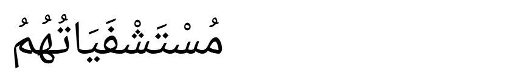
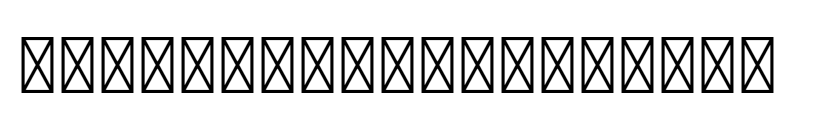
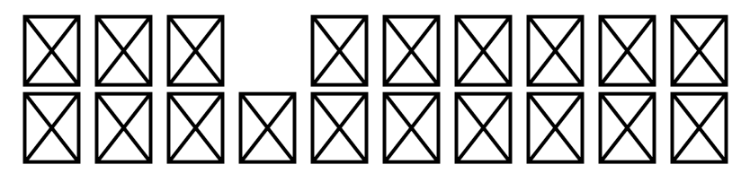

# Pure Tofu Sans

A single-glyph fallback font that maps every Unicode codepoint to the same
placeholder "tofu" shape (an outlined rectangle with an X across it). The
whole font is about 1.2 KB as WOFF2 (3.5 KB as TTF) — small enough to inline
or ship without thinking about it.

## Why

When a browser encounters a codepoint not covered by the page's primary
webfont, it falls back to system fonts. If no installed font covers the
codepoint either, HarfBuzz steps in with generic fallback shaping — mark
stacking, Arabic joining, positioning — which produces inconsistent
results across platforms.

Pure Tofu Sans is designed to be installed as the last entry in a CSS
`font-family` stack so that *every* uncovered codepoint renders as a plain
tofu, deterministically, regardless of platform. It mirrors the trick used
by Adobe's `AND-Regular`: glyph 0 is `.notdef`, glyph 1 is `tofu`, and the
cmap maps the entire Unicode range to glyph 1 so browsers see a real,
covered glyph.

The font also includes no-op GSUB features (`isol`, `init`, `medi`, `fina`)
and no-op GPOS features (`kern`, `mark`, `mkmk`) so HarfBuzz registers the
font as having shaping and positioning data and skips its generic fallback
shapers. A GDEF table classifies `tofu` as a base glyph so codepoints with
Unicode general category "Mark" don't trigger HarfBuzz's mark-stacking
fallback.

## Comparison

The same Arabic string (`مُسْتَشْفَيَاتُهُمُ`, a sequence of base letters
and combining marks) rendered three ways:

**Noto Naskh Arabic** — proper shaping, what a real Arabic font produces:



**Pure Tofu Sans** — one tofu per codepoint, no shaping, no mark stacking - very predictable:



**Adobe Notdef (AND-Regular)** — also a tofu font, but without the GDEF
classification and no-op GSUB/GPOS features. HarfBuzz's Arabic fallback
shaper kicks in: combining marks get stacked above the base tofus,
producing a broken two-row layout instead of a clean fallback:



## Usage

Drop the font into your project and reference it as the last fallback in
your `font-family` stack. The build produces three formats: `.woff2`
(preferred for the web), `.woff`, and `.ttf`.

```css
@font-face {
  font-family: "Pure Tofu Sans";
  src: url("/fonts/PureTofuSans-Regular.woff2") format("woff2"),
       url("/fonts/PureTofuSans-Regular.woff") format("woff"),
       url("/fonts/PureTofuSans-Regular.ttf") format("truetype");
}

body {
  font-family: "Inter", system-ui, "Pure Tofu Sans";
}
```

## Building

```sh
pip install -r requirements.txt
python notdef-generator.py
```

This regenerates `PureTofuSans-Regular.ttf`, `.woff`, and `.woff2`.

## License

This repository is dual-licensed:

- The build script and other source code are licensed under the [MIT License](LICENSE).
- The fonts produced by this project (`PureTofuSans-Regular.ttf`, `.woff`, `.woff2`) are licensed under the [SIL Open Font License 1.1](LICENSE-FONT).